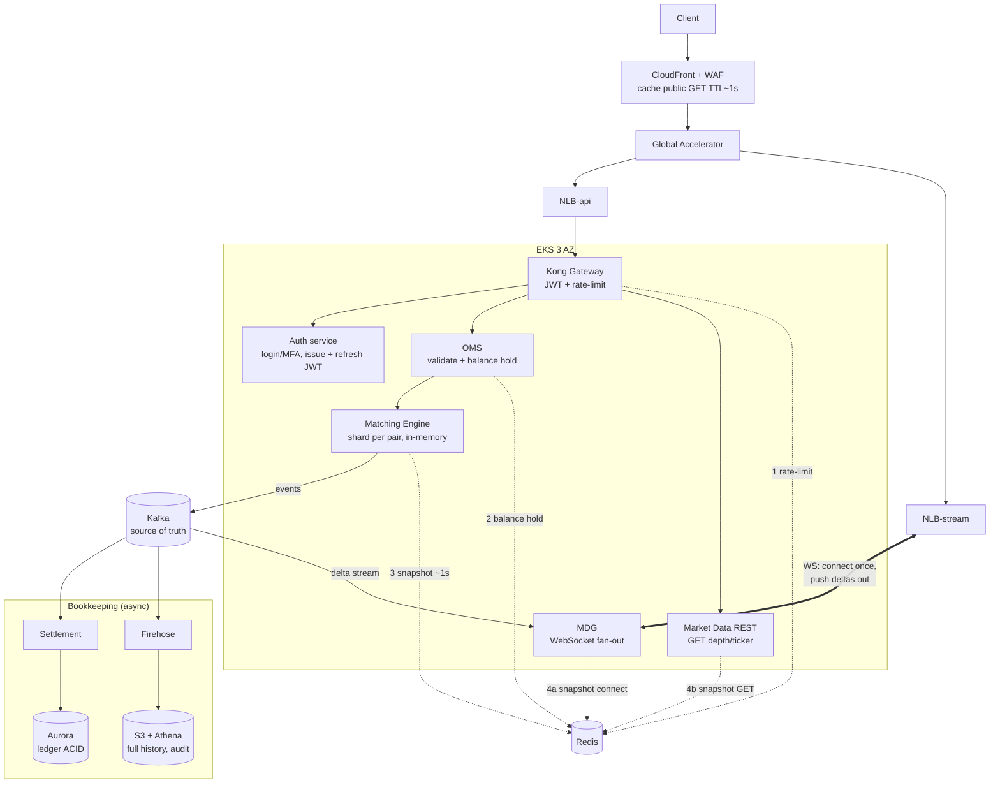
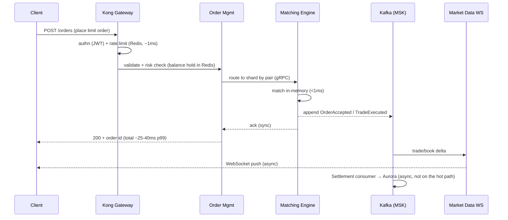
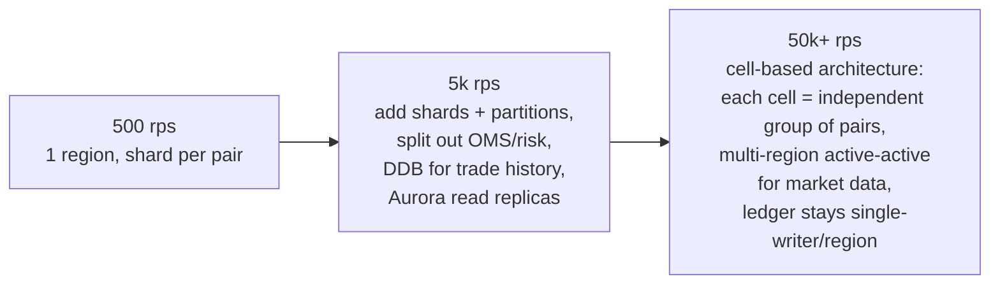

# Problem 1: Building Castle In The Cloud

> Design a Binance-style highly-available trading system on AWS. Constraints: 500 rps, p99 < 100ms.

## 0. Feature scope

Focus on 4 features that represent 4 distinct infrastructure problems:

| Feature | Why chosen |
|---|---|
| **Spot order placement + matching engine** | The exchange's core component; the most complex stateful + latency problem |
| **Real-time market data** (order book, ticker over WebSocket) | A read fan-out problem, the opposite of the write path → showcases two different scaling models |
| **Account & balance (ledger)** | A consistency/audit problem — correctness is not traded for speed |
| **Auth + API gateway** (REST + WS) | The system's entry point; handles rate limiting and abuse prevention |

Out of scope: KYC, fiat on/off-ramp, futures/margin, admin portal — listed in the Assumptions section (§7).

**Key insight**: 500 rps is a small load (a single c7g.xlarge instance can handle it), so the binding constraints are **p99 < 100ms** and **high availability** — architectural choices are evaluated by latency and failure modes, not throughput. The design avoids over-engineering (splitting into dozens of microservices at a 500 rps load) to meet the cost-effectiveness requirement.

## 1. High-level architecture

*Diagram legend: solid lines = request/event paths; dashed lines = the 5 roles of Redis (numbered); the bidirectional arrow NLB-stream↔MDG = the WebSocket connection (client connects once, server pushes back out). Kong/Auth/OMS/MDR/WS/ME are all EKS pods spread across 3 AZs. Identity separation of duties: **the Auth service issues identity** (login/MFA → issues JWTs, stores credential hashes in Aurora, revocation list in Redis), **Kong only guards the gate** (verifies the JWT on every request, holds no credentials); NLBs are created by the AWS Load Balancer Controller (`nlb-target-type: ip`, targeting pod IPs directly); pods sit in private subnets, egress via NAT Gateway. Observability: CloudWatch + Managed Prometheus/Grafana + X-Ray — details in §4.*

## 2. The path of an order (latency budget analysis)

**Latency budget p99 < 100ms**: TLS+edge ~15ms · LB ~2ms · gateway (auth+ratelimit) ~5ms · OMS risk check ~5ms · gRPC hop ~2ms · match <1ms · ack back ~10ms → **~40ms p99**, leaving ~60ms of headroom for GC/jitter/retry. The crux: **DB writes are not on the hot path** — persistence goes through Kafka asynchronously, and the client receives its ack from the engine (event-sourced and replayable, so no data is lost).

## 3. Service choices + alternatives

| Component | Choice | Rationale | Alternatives considered & why rejected |
|---|---|---|---|
| Compute | **EKS** (Graviton c7g) | The matching engine needs long-lived, in-memory state and CPU pinning; K8s provides self-healing + rolling deploys | **Lambda**: cold starts + the 15min limit push p99 over budget, unsuitable for a stateful engine. **ECS Fargate**: sufficient for stateless svc (a valid plan B), but no control over placement/network tuning for the engine. **Plain EC2**: lacks orchestration, failover mechanisms would have to be hand-built |
| Matching engine state | **In-memory + event sourcing via Kafka** | Match <1ms; recovery = replaying the log; single-writer per pair avoids locks | **DB-backed matching** (matching via SQL row locks): p99 rises significantly — an anti-pattern for matching. **Redis as the primary book**: adds a network hop to every match |
| Event backbone | **MSK (Kafka)** | Ordered log per partition = per pair; replay; fan-out to many consumers; ecosystem | **Kinesis**: less to operate but per-shard 1MB/s ingest + higher put latency, weaker consumer-lag tooling. **SQS/SNS**: no ordering guarantees, no replay |
| Ledger/OLTP | **Aurora PostgreSQL Multi-AZ** | ACID for balances, double-entry ledger; failover <30s; read replicas | **DynamoDB**: scales well but multi-row transactions are complex for a ledger, and reconciling/auditing via SQL is hard. DDB is used for **trade history** at the scaling stage (see §5) |
| Cache | **ElastiCache Redis (cluster mode)** | Sessions, rate-limit token buckets, balance holds, book snapshots for newly connected clients | **Memcached**: no data structures/Lua/persistence |
| Market data | **WebSocket service on EKS behind NLB** | Control over fan-out, backpressure, conflation (merging deltas) | **API GW WebSocket**: 2-way per-message $ + added p99, limited control. **AppSync**: the GraphQL model does not fit tick data |
| Edge | CloudFront + WAF + **Global Accelerator** | CloudFront caches public GETs (TTL ~1s, request collapsing + Origin Shield against stampedes); GA provides anycast TCP into the NLB → reduces cross-border p99; WAF (with rate-based rules) sits at CloudFront because WAF cannot attach to an NLB — an acceptable trade-off | CloudFront only: worse for WS/anycast API; Route53 latency routing only solves DNS |
| Load balancer | **NLB (L4) → Kong** | Kong already handles L7 (routing, auth, rate-limit) so an ALB is unnecessary; NLB is faster (~µs), cheaper, preserves source IP, consolidates REST + WS on 1 LB | **ALB**: only needed if Kong is dropped (minimalist option: ALB + in-app middleware); running ALB + Kong together creates two overlapping L7 layers with duplicated functionality, incurring double cost |
| API gateway | **Kong OSS on EKS** | Plugins out of the box: JWT auth, rate-limit policy=redis (centralized counter — many pods share 1 limit), config changes without reload | **AWS API Gateway**: +10-30ms and per-request cost — large overhead against a 100ms p99 budget. **Plain nginx**: limit_req counts locally per pod → limits go wrong when scaling horizontally; a centralized Redis counter requires hand-written Lua, which amounts to reimplementing Kong's functionality. **In-app middleware**: valid at 500 rps, but loses the central control point as services are added |
| Identity | **Self-built Auth service on EKS** | Issues + refreshes JWTs, credential hashes (Argon2) in Aurora, revocation list in Redis; Kong only verifies — separates "issuing identity" from "guarding the gate" | **Cognito**: managed, less sensitive code to write yourself — valid, but custom flows are hard (KYC, velocity checks at login) and pricing is per MAU |
| Trade history / audit | **S3 + Firehose + Athena** | Cheap, immutable, ad-hoc queries; the reconciliation source | Storing everything in Aurora: volume grows fast, high cost |
| IaC / deploy | Terraform + GitOps (ArgoCD) | Reproducible, reviewable, DR = re-apply | ClickOps: not reproducible, not reviewable — rejected |

## 4. HA & failure modes

- **Every tier ≥2 AZs**: EKS node groups spread across 3 AZs; Aurora writer+standby; Redis multi-AZ; MSK 3 brokers/3 AZs, RF=3, `acks=all`.
- **Matching engine failover** (the most complex component due to the single-writer constraint): each pair has 1 primary + 1 warm standby in another AZ; the standby continuously consumes the event log to keep the book in RAM. When the primary fails, the standby is promoted (lease via K8s + fencing token in the Kafka producer epoch), target RTO < 10s, RPO = 0 (the log is the source of truth).
- **Backpressure**: OMS rejects with 429 when the engine queue gets deep; WS conflates deltas when a client is slow — protecting the p99 of the remaining clients.
- **Deliberate degradation**: a market data incident does not stop trading; settlement lag does not stop matching (ledger is async, reconciliation catches up later).
- **DR**: cross-region Aurora replica + MSK mirror (or snapshot + log replay from S3), RTO measured in hours, RPO in minutes — an acceptable trade-off at this scale.

## 5. Scaling plan beyond the current setup

1. **Scale stateless horizontally first** (gateway/OMS/WS = HPA on CPU+RPS) — no architecture change.
2. **Scale matching by sharding per pair** (already designed in): adding a pair = adding a pod + a Kafka partition, no rewrite needed.
3. **Split the read path**: book snapshots + history move to Redis/DDB/S3, Aurora keeps only the ledger.
4. **Cell-based**: each cell serves 1 group of pairs with its own full stack → small blast radius, linear scaling — consistent with the model of major exchanges and AWS Well-Architected guidance.
5. **Multi-region**: market data active-active (read path); the order path stays at 1 region/pair because matching is inherently single-writer — an intrinsic limit of the exchange model, recorded as a design constraint rather than targeting full active-active; GA handles routing users to the right region.

## 6. Cost-effectiveness

- A 500 rps load runs on: 3× c7g.xlarge (engine + core) + 3× c7g.large (stateless) + Aurora db.r7g.large + Redis cache.r7g.large + MSK 3× kafka.m7g.large → **estimated ~$2.5-3.5k/month** before Savings Plans; Graviton + 1yr SP cuts ~40%.
- Spot for the stateless node group; Firehose+S3+Athena instead of keeping history in Aurora; scale-to-zero for non-prod environments.

## 7. Assumptions

- Spot trading only, no margin/futures yet; KYC/fiat out of scope.
- Customers are concentrated in one primary geography (the region is chosen accordingly); global users come in via GA.
- 500 rps is steady-state; the design has 10× burst headroom before an architecture change is needed.
- Security & compliance are handled comprehensively in Problem 5 (Fortify The Castle) and are not restated in this document.
