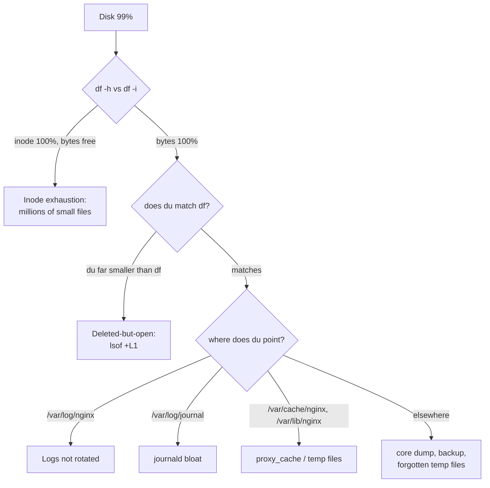

# Problem 2: Diagnose Me Doctor

> Ubuntu 24.04 VM, 64GB disk, monitoring reports storage sustained at 99%. The VM runs a single service: an NGINX load balancer routing traffic to upstreams.

## 0. Assess the situation before typing any commands

Two points determine how to handle this:

1. **This is an LB serving live traffic** → priority #1 is *no disruption*: read/diagnose only at first, and free space using safe operations (truncate, no `rm` on open files, no restart unless necessary).
2. **A full disk on a machine running only NGINX** — the most likely cause is almost always **logs**. Quick estimate: an LB handling 500 rps × ~200 bytes per access-log line ≈ **8-9 GB/day** — without rotation, 64GB fills in ~1 week, matching the "consistently 99%" symptom.

**Real impact of a 100% full disk on an NGINX LB** (often underestimated):
- NGINX **still routes traffic** (failed log writes do not stop the process) — but:
- Requests with large bodies (uploads, large JSON POSTs) that need `client_body_temp` / `proxy_temp` writes → **fail, users get 500** — a direct impact on traffic;
- Losing new logs = no audit/debug data exactly when it is needed most;
- Cert renewal (certbot), apt security updates, and journald all fail;
- SSH logins may be slow/broken (cannot write wtmp, tmp).

## 1. Diagnosis — command sequence in order

```bash
# Step 1: confirm the kind of "full" — out of BYTES or out of INODES? (two different diseases)
df -h /          # bytes
df -i /          # inodes — Use% 100% here while bytes remain free = inode disease

# Step 2: which directory is the culprit? (-x: do not stray into other mounts)
sudo du -x -d1 -h / 2>/dev/null | sort -rh | head -15
# then drill down gradually, typically:
sudo du -x -d1 -h /var 2>/dev/null | sort -rh | head
sudo du -sh /var/log/nginx /var/log/journal /var/cache/nginx /var/lib/nginx 2>/dev/null

# Step 3: common trap — file already rm'd but a process still holds it open (du does not see it, df stays full)
sudo lsof +L1 | sort -k7 -n | tail
# if du totals come out far lower than what df reports → almost certainly this case

# Step 4: system journal bloated?
journalctl --disk-usage

# Step 5: large recently created files (core dumps, forgotten temporary backups/tarballs)
sudo find / -xdev -size +500M -exec ls -lh {} \; 2>/dev/null
```

Decision tree:



## 2. Expected root causes — impact & recovery per case

### Case 1 — Access/error logs not rotated (most likely)

- **Identification**: `/var/log/nginx/access.log` at tens of GB, or logrotate has a config but it is broken (`sudo logrotate -d /etc/logrotate.d/nginx` to see errors; commonly: missing `create`/`copytruncate`, cron not running, logs written to a path other than the configured one).
- **Impact**: disk fills up steadily → the impacts in §0.
- **Recovery (safe, no downtime)**:

```bash
# Free space immediately: truncate, do NOT rm (nginx is holding the fd; rm will not give the bytes back)
sudo truncate -s 0 /var/log/nginx/access.log
# or keep the tail for investigation:
sudo tail -c 100M /var/log/nginx/access.log | sudo tee /root/access.tail > /dev/null && sudo truncate -s 0 /var/log/nginx/access.log
```

- **If the log must be PRESERVED as evidence before truncating** (works even with a full disk, zero-downtime):

```bash
# stream it off-box, consuming no local bytes at all (compressed on-the-fly through RAM):
gzip -c /var/log/nginx/access.log | aws s3 cp - s3://incident-bucket/lb01-access.log.gz

# or expand capacity right away: grow the EBS volume online, ~2 minutes, no downtime
aws ec2 modify-volume --volume-id vol-xxx --size 128
sudo growpart /dev/nvme0n1 1 && sudo resize2fs /dev/nvme0n1p1
```

- **Prevention**: fix logrotate (daily + `rotate 7` + `compress` + `postrotate nginx -s reopen`); reduce the source — a minimal JSON access log or `access_log ... if=$loggable` (sample 100% of errors, 1-10% of HTTP 200 requests), ship logs off-box (CloudWatch Agent / Vector / Fluent Bit) so the machine keeps only 1-2 days.

### Case 2 — File deleted but NGINX still holds it open (deleted-but-open)

- **Identification**: the log was `rm`'d directly in a previous incident response (the filename was deleted but nginx still holds the file descriptor) → `du` sees little, `df` still shows 99%; `lsof +L1` reveals a large `(deleted)` file held by the nginx process.
- **Impact**: same as case 1, plus it muddies diagnosis (du and df diverge by tens of GB).
- **Recovery**: tell nginx to reopen its log files — no restart needed:

```bash
sudo nginx -s reopen    # sends USR1, nginx releases the old fd → kernel reclaims the space instantly
```

- **Prevention**: the on-call procedure explicitly states "never rm an open log — use truncate"; a proper logrotate config already includes `reopen`.

### Case 3 — journald bloat

- **Identification**: `journalctl --disk-usage` returns several GB to tens of GB (`/var/log/journal`).
- **Impact**: consumes space; journald itself crash-loops when out of space → system logs are lost.
- **Recovery & prevention**:

```bash
sudo journalctl --vacuum-size=500M
# pin a hard cap: /etc/systemd/journald.conf → SystemMaxUse=500M → systemctl restart systemd-journald
```

### Case 4 — NGINX proxy_cache / temp files

- **Identification**: `du` points to `/var/cache/nginx` or `/var/lib/nginx/{proxy,body}`. Happens when `proxy_cache` is enabled **without declaring `max_size`** (cache grows unbounded), or slow upstreams force large responses/bodies to be buffered to disk.
- **Impact**: disk fills abruptly with traffic; when temp writes fail → large-body requests get 500 even before the disk hits 100%.
- **Recovery**: safe to delete directly since this is cache data: `sudo find /var/cache/nginx -type f -delete` (nginx rebuilds it); short-term, `proxy_buffering off` can be set for heavy locations.
- **Prevention**: `proxy_cache_path ... max_size=5g inactive=7d`; limit `client_max_body_size`; if it is a pure LB with no need for caching → disable it.

### Case 5 — Inode exhaustion (bytes still free yet "No space left" errors)

- **Identification**: `df -i` at 100% while `df -h` shows free space — millions of small files (usually session/tmp/cache from another process that once ran on the machine).
- **Impact**: every attempt to create a new file fails — symptoms identical to a full disk, easily misdiagnosed.
- **Recovery**: find directories holding many files (`find /var -xdev -type d -size +1M` — a large dir size = many entries) then clean up in batches.
- **Prevention**: alert on `disk_inodes_free`, not just bytes.

### Case 6 — Orphaned files: core dumps, backups, forgotten tarballs

- **Identification**: step 5 (`find -size +500M`) reveals `core.*`, `/var/crash/*`, `*.tar.gz` created during manual debugging/backup and then forgotten.
- **Recovery**: confirm nobody needs them, then delete; if core dumps recur, investigate the crashing process + limit via `sysctl kernel.core_pattern`.

## 3. Preventing recurrence (apply fleet-wide)

1. **Alert early**: disk 80% warning / 90% critical + **inodes** + *growth rate* (predict "full in N days" from the slope) — alerting only at 99% is a monitoring gap; this incident should have been visible a full week in advance.
2. **Ship logs off-box** (CloudWatch Agent/Vector/Fluent Bit) + 1-2 days local retention → the local disk is no longer where logs live.
3. **Separate the `/var/log` partition** (or a dedicated volume): full logs cannot eat into the space reserved for the OS and nginx temp files.
4. **Codify**: put logrotate + the journald cap + nginx cache max_size into IaC/AMI (Ansible/cloud-init), applied to every LB — an incident on one machine means every identically configured machine is at risk of the same incident.
5. **Runbook** with the exact command order of §1 + the "truncate, don't rm" rule for on-call.
