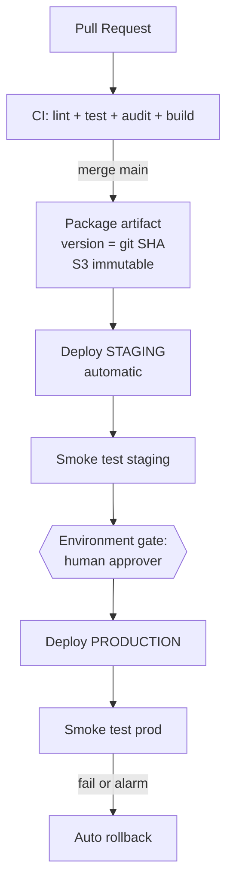

# Problem 4: Ship It Twice

> Production-ready CI/CD with GitHub Actions for: backend (HTTP API → EC2) and frontend (static SPA → S3). No real AWS account required — wherever something cannot actually be run, it is implemented honestly with an explanation of what it would do.

## 1. Definition of "production ready" within the scope of this exercise

Each criterion maps to a specific mechanism in the workflows:

| Criterion | Mechanism in the pipeline |
|---|---|
| No static secrets | **GitHub OIDC → IAM role** per environment; no AWS keys anywhere in the repo/secrets |
| Reproducible builds | `npm ci` + lockfile + `.nvmrc`; artifact packaged once, **the same artifact goes staging → prod** (no rebuild) |
| Immutable artifacts | S3 upload with `--if-none-match "*"` (no overwrite), bucket versioning; version = git SHA |
| No overlapping deploys | `concurrency` group per env, `cancel-in-progress: false` |
| Human approval gate for prod | GitHub Environment `production` + required reviewers |
| Gradual release + auto rollback | Backend: CodeDeploy blue/green `LinearPercent10Every3Minutes` + auto-rollback on CloudWatch alarms (5xx, p99). Frontend: index.html is a pointer — rollback = re-point, instant |
| Post-deploy verification | Smoke test through the exact URL users hit; on failure → pipeline stops, promotion is blocked |
| Clear rollback path | `workflow_dispatch` with input `rollback_to=<sha>` for both apps |
| Supply-chain protection | Pin actions by commit SHA (noted in the file), `npm audit` blocks critical vulns, artifact retention |

## 2. Pipeline architecture

**Backend** (`.github/workflows/backend.yml`): CI → tarball to S3 → CodeDeploy blue/green into the staging ASG → smoke → gate → CodeDeploy to prod as a 10%/3-minute canary, with `--auto-rollback-configuration` wired to the alarms — new instances register with the LB, old instances drain after the bake time. If the deploy fails or an alarm fires mid-rollout → CodeDeploy automatically reverts to the previous version, with no manual intervention required.

**Frontend** (`.github/workflows/frontend.yml` + `scripts/deploy-spa.sh`): immutable S3 layout `releases/<sha>/` + root `index.html` acting as a pointer. Race-proof upload order: hash-named assets first (`immutable` cache for 1 year) → the release's index → copy over the pointer → invalidate only the pointer (`/index.html` + `/`). **Rollback = re-point the index to a previous release**: 1 copy command + 1 invalidation, ~30 seconds, no rebuild.

## 3. Assumptions (and why)

- **Monorepo** `backend/` + `frontend/` — path filters so that a change in one app only runs that app's pipeline; the 2 apps are split into 2 independent workflows, matching the "ship it twice" requirement.
- Backend is Node.js, running under systemd on EC2 in an **Auto Scaling Group behind an LB** — a single standalone EC2 instance cannot satisfy "production ready" (SPOF); CodeDeploy is the standard AWS service for blue/green on ASGs.
- 2 separate AWS accounts for staging/prod (placeholder IDs `111.../222...`) — blast radius and IAM roles separated per env.
- The infrastructure (ASG, LB, bucket, CloudFront, CodeDeploy app, OIDC IAM role) already exists and **is managed by Terraform in a separate repo** — this pipeline only ships code, it does not create infrastructure (separation of privileges: the deploy role has no permission to modify infra).
- The SPA is built once, env-agnostic, with runtime config via `/config.json` per env — avoiding a separate build per env (which would violate "the same artifact goes to every env").
- Everything that requires real AWS has been implemented honestly with real AWS CLI commands (create-deployment, s3 sync, create-invalidation) — runnable as soon as real ARNs/bucket names are filled in.

## 4. Items deliberately left out of scope (trade-offs stated explicitly)

- **No containerization of the backend** — the problem statement specifies EC2; bringing in Docker/ECS would exceed the required scope. If the infrastructure could be chosen again, ECS/EKS + SHA-tagged images is the natural evolution.
- **No IaC in this pipeline** — infra is managed by a separate Terraform repo; mixing infra apply into the app pipeline would force the deploy role to expand its permissions beyond what is necessary.
- **No e2e test suite** — the smoke test only confirms the service is up and returns the correct response structure; a full e2e suite belongs in a separate test repo, run after the staging deploy (a hook has been left in place).
- **No automated DAST/pentest, no signed SBOM** — filed as next steps once the pipeline stabilizes; this keeps the pipeline easy to read and understand within the scope of the exercise.
- **No multi-channel notifications** — a single Slack webhook is enough for illustration purposes.
- **Application runtime secrets** (DB passwords...) do not pass through GitHub — the app fetches them from SSM Parameter Store/Secrets Manager via the instance role at runtime; the pipeline never touches these secrets.

## 5. Verification limits

Without a real AWS account, the `aws deploy`/`s3`/`cloudfront` parts have not been run end-to-end; what has been verified: valid YAML syntax, job/needs/gate logic correct per the GitHub Actions docs, bash scripts with `set -euo pipefail` + no shellcheck warnings. What must be filled in for a real run: the OIDC role ARN, bucket names, the CloudFront distribution ID, the CloudWatch alarms attached to the deployment group.
