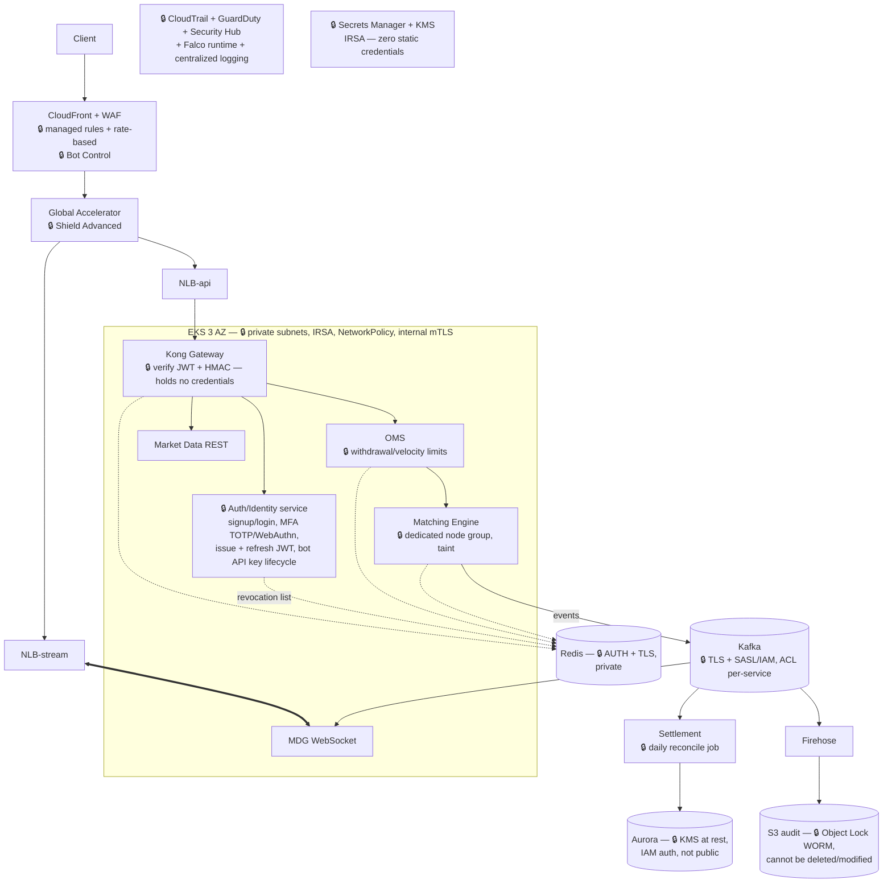

# Problem 5: Fortify The Castle

> Take the Problem 1 architecture (trading system on AWS) and integrate security into the design itself — explicitly calling out what changed, what was added, and which risks are accepted; which items come first, which are deferred, and which are mandatory before shipping.

## 0. Threat model — assets to protect and the corresponding adversaries

Assets ranked by value: **(1) money in the ledger** (one wrong row = real money lost, irreversible) → **(2) user accounts** (credentials = their money) → **(3) market integrity** (a manipulated order book = the exchange loses its reputation) → **(4) PII/KYC data**.

The realistic adversaries of an exchange: industrial-scale credential stuffing/ATO, API abuse & manipulation bots, extortion DDoS, insiders (devs/ops with prod access), supply-chain attacks (dependencies, CI), and targeted attackers going after the wallet/ledger. Every change below maps back to at least one of these adversaries.

## 1. Hardened architecture — changes marked 🔒

## 2. Changes by layer — what, which adversary it targets, and why

### 2.1 Edge & identity (against ATO, abuse, DDoS)

| Change | Defends against |
|---|---|
| WAF managed rules (OWASP, known-bad-inputs) + **rate-based rule** per-IP at CloudFront | L7 abuse, scanners, deliberate stampedes |
| **Bot Control + mandatory MFA at login** (TOTP/WebAuthn), short JWT TTL (≤15m) + refresh rotation, Redis revocation list (already present from P1) | Credential stuffing / account takeover — the top attack vector against trading exchanges |
| **API keys for trading bots: HMAC-signed requests** (key + secret, each request signed with timestamp + nonce; per-key scopes: read-only / trade / withdraw separated) — the Binance model | A key leaked on the client is not enough to withdraw funds; replay attacks blocked by the nonce |
| **Dedicated Auth/Identity service** in a private subnet: holds credentials (Argon2 hashes) + the entire signup/login/MFA flow, **issues + refreshes JWTs**, manages the bot API key lifecycle; Kong only **verifies**, holds no credentials at all. (Alternative: Cognito — managed but hard to customize the KYC flow, priced per MAU) | Separates "issuing identity" from "guarding the gate" — only one single place touches credentials, narrowing the surface that must be audited most strictly |
| Shield Advanced (once revenue justifies the $3k/month fee — see §4) | Extortion DDoS |

### 2.2 Network (shrinking the surface)

- **Every datastore and pod in private subnets** — only the 2 NLBs are public; Aurora/Redis/MSK have no internet path, security groups follow the principle "who may call whom is declared explicitly" (already present from P1, now elevated to a mandatory requirement).
- **VPC endpoints** for S3/ECR/Secrets Manager/CloudWatch — AWS traffic never leaves for the internet, also eliminating the NAT requirement for those paths.
- **EKS**: default-deny NetworkPolicy between namespaces (MDR has no reason to call the Engine); **service-to-service mTLS** — an upgrade from P1's plaintext-inside-VPC, a significant design change because the threat model includes insiders/compromised pods; the matching engine runs on a dedicated tainted node group (other workloads are not scheduled onto the same machines).
- Operational access: **SSM Session Manager instead of SSH** — no port 22, no key files, every session logged.

### 2.3 Data & secrets (against exposure and tampering)

- **KMS encryption at rest everywhere**: EBS, Aurora, S3, MSK, snapshots — near-zero cost, enabled by default from the moment each resource is created.
- **S3 audit bucket with Object Lock (WORM) + versioning**: trade history/audit logs **cannot be deleted or modified by anyone, including admins** — S3's role shifts from low-cost storage (P1) to evidence storage; this is the last line of defense against both insiders and attackers trying to erase their tracks.
- **Secrets Manager + IRSA**: pods receive AWS permissions via service accounts, secrets rotate automatically — **zero static credentials** in code/env/CI. PII (KYC) in separate tables, field-level encryption, dedicated key.

### 2.4 Ledger & business logic (against losing money — asset #1)

- **Double-entry ledger + append-only**: every entry has a debit/credit pair, UPDATE/DELETE forbidden on the entries table (corrections = reversing entries). 
- **Daily reconcile job**: reconciles the Aurora ledger ↔ the Kafka/S3 event log — any discrepancy, however small, raises a P1-level alert. The WORM event log above is precisely the reconciliation source that cannot be forged.
- **Velocity/withdrawal limits in the OMS**: caps on order value/minute/user, cooldown after password changes/new devices — limits the damage when an ATO succeeds (defense in depth: assume the perimeter can be breached).

### 2.5 Supply chain & CI/CD (against bypass routes through the deploy path)

- GitHub Actions uses an **OIDC least-privilege role** (from P4), actions pinned by SHA, `npm audit` gate.
- **ECR image scanning + cosign image signing**; EKS admission policy only runs signed images from our own registry.
- **CI never has cluster-admin**: the deploy role may only modify its own app namespace — a runner with cluster-admin allows bypassing every other control, so it is ruled out from the design itself.
- GitOps (ArgoCD) = every infrastructure change gets PR review + an audit trail.

### 2.6 Detection & response (detecting when under attack)

- **Org-wide CloudTrail** (logs shipped to a separate account, WORM), **GuardDuty** (EKS + S3 + IAM findings), Security Hub aggregating everything in one place.
- **Falco** runtime on EKS (exec into a pod, unusual outbound from the engine → immediate alert).
- Business-anomaly alerts: logins from unusual geographies, abnormal per-account order spikes (wired into the velocity limits).
- Incident runbook: contain first (revoke sessions, freeze accounts, scale-to-zero the compromised service), investigate later — the WORM audit trail guarantees the evidence stays intact.

## 3. Priority order

**Refuse to ship without (ship-blockers):**
1. Private subnets + tight SGs for every datastore — a publicly exposed datastore is an unacceptable risk for a trading exchange.
2. Zero static credentials (IRSA + Secrets Manager + OIDC CI).
3. KMS at rest + TLS in transit on every path.
4. MFA + short JWTs + HMAC-signed API keys — because ATO is the top attack vector.
5. WAF + rate-limit (already in P1).
6. WORM audit log + double-entry ledger + reconcile — without these mechanisms, the correctness of the ledger cannot be proven.
7. CI least-privilege — a CI with unlimited permissions neutralizes every other control.

**Right after launch (first weeks to months):** Falco runtime, cosign + admission policy, GuardDuty tuning, PII field-level encryption, failover chaos testing with a security lens, first external pentest.

**Deliberately deferred:** Shield Advanced ($3k/month — enable once there is revenue or a real threat has materialized); full service mesh (minimal mTLS via cert-manager + sidecar first, a mesh once the service count grows); SOC2/ISO (when enterprise customers require it); public bug bounty (after the first private pentest round).

**Accepted risks (stated explicitly):**
- Insiders with legitimate access can still read operational data — mitigated with least-privilege + audit + 4-eyes for sensitive operations, cannot be eliminated entirely.
- Sophisticated L7 DDoS bypassing the WAF before Shield Advanced is enabled — accepted in the early stage in exchange for keeping $36k/year.
- Single-region: a region incident = downtime (RTO in hours) — an availability risk already declared in P1, not a security vulnerability.

## 4. Missing inputs — information needs, sources, working assumptions

| Need to know | Source | Working assumption |
|---|---|---|
| Jurisdiction & licensing (determines KYC/AML depth, data residency) | Legal/compliance | Single jurisdiction, no specific residency requirement yet |
| Custody model (does the exchange hold real wallets or only an internal ledger?) | Product | **Internal ledger only** — hot/cold wallets + HSM/MPC out of scope; if real custody exists, this item becomes the highest priority, ahead of everything else |
| Operational security budget (Shield, pentest, tooling) | Finance | Startup stage — pick free/cheap controls first (most of §2 is config, not licenses) |
| Legal/investigation SLA on log retention | Legal | Keep the WORM audit trail for 7 years on S3 Glacier |

The key point: **most of the changes here are configuration and design discipline (private subnets, KMS, IRSA, WORM, least-privilege) — adding almost no extra infrastructure cost**; only 2 items are genuinely expensive (Shield Advanced, pentest/tooling), and both are deliberately scheduled rather than "bolted on at the end of the project".
